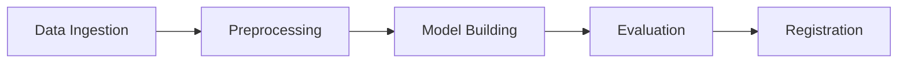

# 🎬 YouTube Sentiment Analysis - End-to-End MLOps Pipeline

[](https://www.python.org/downloads/)
[](https://fastapi.tiangolo.com/)
[](https://mlflow.org/)
[](https://dvc.org/)
[](https://lightgbm.readthedocs.io/)
[](LICENSE)

> **Production-ready ML pipeline** for real-time YouTube comment sentiment analysis with MLOps best practices, DVC data versioning, MLflow experiment tracking, and a Chrome extension for instant insights.

---

## 📋 Table of Contents

- [🎯 Project Overview](#-project-overview)
- [🏗️ Architecture](#️-architecture)
- [✨ Features](#-features)
- [🚀 Quick Start](#-quick-start)
- [⚙️ Detailed Setup](#️-detailed-setup)
- [📊 Data Pipeline](#-data-pipeline)
- [🔌 API Documentation](#-api-documentation)
- [🧩 Chrome Extension](#-chrome-extension)
- [🛠️ Tech Stack](#️-tech-stack)
- [📂 Project Structure](#-project-structure)
- [🐛 Troubleshooting](#-troubleshooting)

---

## 🎯 Project Overview

An **end-to-end MLOps system** that analyzes sentiment in YouTube video comments using:
- **DVC** for reproducible data pipeline orchestration
- **MLflow** for experiment tracking and model registry
- **AWS (S3 + EC2)** for artifact storage and tracking server
- **FastAPI** for production-ready REST API
- **Chrome Extension** for real-time analysis directly on YouTube

**Sentiment Classification**: Positive (1), Neutral (0), Negative (-1)

---

## 🏗️ Architecture

```
┌─────────────────┐
│  YouTube API    │
│  (Comments)     │
└────────┬────────┘
         │
         ▼
┌─────────────────────────────────────────────────┐
│           DVC Pipeline (5 Stages)               │
├─────────────────────────────────────────────────┤
│  1. Data Ingestion   → Load & Split            │
│  2. Preprocessing    → NLP Cleaning             │
│  3. Model Building   → TF-IDF + LightGBM        │
│  4. Evaluation       → Metrics + MLflow Log     │
│  5. Registration     → MLflow Model Registry    │
└────────┬────────────────────────────────────────┘
         │
         ▼
┌─────────────────────────────────────────────────┐
│        AWS Infrastructure                       │
├─────────────────────────────────────────────────┤
│  • S3: Artifact Storage (models, metrics)       │
│  • EC2: MLflow Tracking Server                  │
└────────┬────────────────────────────────────────┘
         │
         ▼
┌─────────────────────────────────────────────────┐
│        FastAPI Backend (6 Endpoints)            │
├─────────────────────────────────────────────────┤
│  • /predict                                     │
│  • /predict_with_timestamps                     │
│  • /generate_chart                              │
│  • /generate_wordcloud                          │
│  • /generate_trend_graph                        │
└────────┬────────────────────────────────────────┘
         │
         ▼
┌─────────────────────────────────────────────────┐
│        Chrome Extension                         │
│  (Real-time YouTube Comment Analysis)           │
└─────────────────────────────────────────────────┘
```

---

## ✨ Features

### 🤖 ML Pipeline
- ✅ **Automated data versioning** with DVC
- ✅ **Experiment tracking** with MLflow (metrics, params, artifacts)
- ✅ **Model registry** with staging/production lifecycle management
- ✅ **Reproducible pipelines** with YAML configuration
- ✅ **Class imbalance handling** with balanced LightGBM

### 🌐 API Features
- ✅ **6 RESTful endpoints** for predictions and visualizations
- ✅ **Real-time inference** with <100ms latency
- ✅ **Batch processing** up to 500 comments
- ✅ **Dynamic visualizations** (pie charts, word clouds, trend graphs)

### 🔌 Chrome Extension
- ✅ **One-click analysis** on any YouTube video
- ✅ **Real-time metrics dashboard** (sentiment score, comment stats)
- ✅ **Visual insights** (charts, word clouds, trends)
- ✅ **Top 25 comments** with sentiment labels

---

## 🚀 Quick Start

### Prerequisites
- Python 3.10+
- AWS Account (for MLflow + S3)
- YouTube Data API Key
- Git

### 1️⃣ Clone Repository
```bash
git clone https://github.com/yourusername/youtube-sentiment-analysis.git
cd youtube-sentiment-analysis
```

### 2️⃣ Install Dependencies
```bash
# Create virtual environment
python -m venv venv
source venv/bin/activate  # On Windows: venv\Scripts\activate

# Install requirements
pip install -r requirements.txt

# Download NLTK data
python -c "import nltk; nltk.download('stopwords'); nltk.download('wordnet')"
```

### 3️⃣ Configure AWS (see [Detailed Setup](#️-detailed-setup))
```bash
aws configure
```

### 4️⃣ Run DVC Pipeline
```bash
dvc repro
```

### 5️⃣ Start API Server
```bash
uvicorn app:app --host 0.0.0.0 --port 5000 --reload
```

### 6️⃣ Test API
```bash
curl http://localhost:5000/
# Visit http://localhost:5000/docs for interactive documentation
```

---

## ⚙️ Detailed Setup

### 🔧 1. AWS Infrastructure Setup

#### Step 1: Create IAM User
1. Login to [AWS Console](https://aws.amazon.com/console/)
2. Navigate to **IAM** → **Users** → **Add User**
3. Attach **AdministratorAccess** policy
4. Download credentials (Access Key ID + Secret Access Key)

#### Step 2: Configure AWS CLI
```bash
# Install AWS CLI (if not installed)
curl "https://awscli.amazonaws.com/awscli-exe-linux-x86_64.zip" -o "awscliv2.zip"
unzip awscliv2.zip
sudo ./aws/install

# Configure credentials
aws configure
# Enter:
#   AWS Access Key ID: YOUR_ACCESS_KEY
#   AWS Secret Access Key: YOUR_SECRET_KEY
#   Default region: us-east-1
#   Default output format: json
```

#### Step 3: Create S3 Bucket
```bash
# Replace 'your-mlflow-bucket' with your unique bucket name
aws s3 mb s3://your-mlflow-bucket --region us-east-1
```

#### Step 4: Launch EC2 Instance for MLflow
1. **Launch Instance**:
   - AMI: Ubuntu Server 22.04 LTS
   - Instance Type: t2.medium (recommended) or t2.micro (minimum)
   - Storage: 20GB
   
2. **Configure Security Group**:
   - Add inbound rule: **Custom TCP**, Port **5000**, Source **0.0.0.0/0**

3. **SSH into EC2**:
```bash
ssh -i your-key.pem ubuntu@YOUR_EC2_PUBLIC_IP
```

#### Step 5: Setup MLflow on EC2
```bash
# Update system
sudo apt update && sudo apt upgrade -y

# Install Python and dependencies
sudo apt install python3-pip python3-venv -y

# Create MLflow directory
mkdir ~/mlflow && cd ~/mlflow

# Create virtual environment
python3 -m venv venv
source venv/bin/activate

# Install MLflow and AWS tools
pip install mlflow boto3 awscli

# Configure AWS on EC2
aws configure
# Enter your AWS credentials

# Start MLflow server
mlflow server \
    -h 0.0.0.0 \
    -p 5000 \
    --backend-store-uri sqlite:///mlflow.db \
    --default-artifact-root s3://your-mlflow-bucket/mlflow-artifacts

# Keep server running (use screen or tmux)
# Option 1: Using screen
sudo apt install screen -y
screen -S mlflow
mlflow server -h 0.0.0.0 -p 5000 --default-artifact-root s3://your-mlflow-bucket/mlflow-artifacts
# Press Ctrl+A, then D to detach

# Option 2: Using nohup
nohup mlflow server -h 0.0.0.0 -p 5000 --default-artifact-root s3://your-mlflow-bucket/mlflow-artifacts > mlflow.log 2>&1 &
```

#### Step 6: Set MLflow Tracking URI (Local Machine)
```bash
# Export in terminal
export MLFLOW_TRACKING_URI=http://YOUR_EC2_PUBLIC_IP:5000/

# Or add to ~/.bashrc for persistence
echo 'export MLFLOW_TRACKING_URI=http://YOUR_EC2_PUBLIC_IP:5000/' >> ~/.bashrc
source ~/.bashrc
```

**Update in Code**: Replace the MLflow tracking URI in:
- `src/model/model_evaluation.py` (line 90)
- `src/model/register_model.py` (line 5)

```python
mlflow.set_tracking_uri("http://YOUR_EC2_PUBLIC_IP:5000/")
```

---

### 📦 2. DVC Pipeline Setup

#### Initialize DVC
```bash
# Initialize DVC (if not already done)
dvc init

# Add S3 remote for DVC (optional)
dvc remote add -d myremote s3://your-dvc-bucket/dvc-cache
dvc remote modify myremote region us-east-1
```

#### Configure Parameters
Edit `params.yaml` to customize hyperparameters:
```yaml
data_ingestion:
  test_size: 0.20

model_building:
  ngram_range: [1, 3]      # Use unigrams to trigrams
  max_features: 1000       # TF-IDF feature limit
  learning_rate: 0.09
  max_depth: 20
  n_estimators: 367
```

#### Run Complete Pipeline
```bash
# Run all stages (data ingestion → model registration)
dvc repro

# Visualize pipeline DAG
dvc dag

# Check pipeline status
dvc status
```

#### Run Individual Stages
```bash
# Run specific stage
dvc repro model_building

# Force re-run a stage
dvc repro -f data_ingestion
```

---

### 🖥️ 3. FastAPI Backend Setup

#### Start Development Server
```bash
# With auto-reload
uvicorn app:app --host 0.0.0.0 --port 5000 --reload

# Production mode (4 workers)
uvicorn app:app --host 0.0.0.0 --port 5000 --workers 4
```

#### Test API Endpoints
```bash
# 1. Home endpoint
curl http://localhost:5000/

# 2. Prediction
curl -X POST http://localhost:5000/predict \
  -H "Content-Type: application/json" \
  -d '{"comments": ["Great video!", "Terrible content"]}'

# 3. Interactive documentation
open http://localhost:5000/docs
```

---

### 🧩 4. Chrome Extension Setup

#### Configure Extension
1. **Update API URL** in `yt_chrome_plugin_frontend/popup.js`:
   ```javascript
   const API_URL = 'http://localhost:5000';  // Local testing
   // const API_URL = 'http://YOUR_PRODUCTION_URL';  // Production
   ```

2. **Add YouTube API Key** in `popup.js` (line 4):
   ```javascript
   const API_KEY = 'YOUR_YOUTUBE_API_KEY';
   ```

#### Get YouTube API Key
1. Go to [Google Cloud Console](https://console.cloud.google.com/)
2. Create a new project
3. Enable **YouTube Data API v3**
4. Create credentials → API Key
5. Copy the API key

#### Load Extension in Chrome
1. Open Chrome and go to `chrome://extensions/`
2. Enable **Developer mode** (top right)
3. Click **Load unpacked**
4. Select `yt_chrome_plugin_frontend` folder
5. Extension should appear in your toolbar

#### Test Extension
1. Navigate to any YouTube video
2. Click the extension icon
3. Wait for sentiment analysis results

---

## 📊 Data Pipeline

### Pipeline Stages (DVC)



#### Stage 1: Data Ingestion
- **Input**: Raw CSV from GitHub
- **Process**: Load → Clean → Split (80/20)
- **Output**: `data/raw/train.csv`, `data/raw/test.csv`

#### Stage 2: Preprocessing
- **Input**: Raw data
- **Process**: 
  - Lowercase conversion
  - Remove special characters
  - Stopword removal (keep negations)
  - Lemmatization
- **Output**: `data/interim/train_processed.csv`, `data/interim/test_processed.csv`

#### Stage 3: Model Building
- **Input**: Preprocessed data
- **Process**: 
  - TF-IDF vectorization (trigrams, 1000 features)
  - Train LightGBM classifier
- **Output**: `lgbm_model.pkl`, `tfidf_vectorizer.pkl`

#### Stage 4: Evaluation
- **Input**: Trained model + test data
- **Process**: 
  - Generate predictions
  - Calculate metrics (precision, recall, F1)
  - Log to MLflow
  - Save confusion matrix
- **Output**: `experiment_info.json`, metrics in MLflow

#### Stage 5: Registration
- **Input**: Experiment info
- **Process**: Register model in MLflow registry
- **Output**: Model in "Staging" stage

---

## 🔌 API Documentation

### Base URL
```
http://localhost:5000
```

### Endpoints

#### 1. **Home** `GET /`
```bash
curl http://localhost:5000/
```
**Response**:
```json
{"message": "Welcome to our FastAPI sentiment analysis API"}
```

---

#### 2. **Predict** `POST /predict`
Analyze sentiment for a list of comments.

**Request**:
```bash
curl -X POST http://localhost:5000/predict \
  -H "Content-Type: application/json" \
  -d '{
    "comments": [
      "I love this video!",
      "This is terrible",
      "Not bad"
    ]
  }'
```

**Response**:
```json
[
  {"comment": "I love this video!", "sentiment": "1"},
  {"comment": "This is terrible", "sentiment": "-1"},
  {"comment": "Not bad", "sentiment": "0"}
]
```

---

#### 3. **Predict with Timestamps** `POST /predict_with_timestamps`
Analyze sentiment with timestamp information.

**Request**:
```bash
curl -X POST http://localhost:5000/predict_with_timestamps \
  -H "Content-Type: application/json" \
  -d '{
    "comments": [
      {"text": "Great!", "timestamp": "2024-01-15T10:30:00"},
      {"text": "Bad", "timestamp": "2024-01-16T14:20:00"}
    ]
  }'
```

**Response**:
```json
[
  {
    "comment": "Great!",
    "sentiment": "1",
    "timestamp": "2024-01-15T10:30:00"
  },
  {
    "comment": "Bad",
    "sentiment": "-1",
    "timestamp": "2024-01-16T14:20:00"
  }
]
```

---

#### 4. **Generate Chart** `POST /generate_chart`
Generate sentiment distribution pie chart.

**Request**:
```bash
curl -X POST http://localhost:5000/generate_chart \
  -H "Content-Type: application/json" \
  -d '{"sentiment_counts": {"1": 150, "0": 50, "-1": 30}}' \
  --output chart.png
```

**Response**: PNG image

---

#### 5. **Generate Word Cloud** `POST /generate_wordcloud`
Generate word cloud from comments.

**Request**:
```bash
curl -X POST http://localhost:5000/generate_wordcloud \
  -H "Content-Type: application/json" \
  -d '{"comments": ["Great video", "Love this", "Amazing"]}' \
  --output wordcloud.png
```

**Response**: PNG image

---

#### 6. **Generate Trend Graph** `POST /generate_trend_graph`
Generate sentiment trend over time.

**Request**:
```bash
curl -X POST http://localhost:5000/generate_trend_graph \
  -H "Content-Type: application/json" \
  -d '{
    "sentiment_data": [
      {"sentiment": 1, "timestamp": "2024-01-15T10:30:00"},
      {"sentiment": -1, "timestamp": "2024-02-10T14:20:00"}
    ]
  }' \
  --output trend.png
```

**Response**: PNG image

---

## 🛠️ Tech Stack

### **Core ML/Data**
- **Python 3.10+** - Primary language
- **LightGBM 4.5.0** - Gradient boosting model
- **Scikit-learn 1.5.2** - TF-IDF vectorization, train-test split
- **NLTK 3.9.1** - Text preprocessing (lemmatization, stopwords)
- **Pandas 2.2.3** - Data manipulation
- **NumPy 2.1.2** - Numerical operations

### **MLOps & Orchestration**
- **DVC 3.53.0** - Data versioning and pipeline orchestration
- **MLflow 2.17.0** - Experiment tracking and model registry
- **YAML** - Configuration management

### **Cloud & Infrastructure**
- **AWS S3** - Artifact storage
- **AWS EC2** - MLflow tracking server
- **Boto3 1.35.36** - AWS SDK

### **API & Backend**
- **FastAPI 0.115.0** - REST API framework
- **Uvicorn 0.30.6** - ASGI server
- **Pydantic 2.9.2** - Data validation

### **Visualization**
- **Matplotlib 3.9.2** - Chart generation
- **Seaborn 0.13.2** - Statistical visualizations
- **WordCloud 1.9.3** - Word cloud generation

### **Frontend**
- **Chrome Extension (Manifest V3)** - Browser integration
- **JavaScript** - Extension logic
- **YouTube Data API v3** - Comment fetching

---

## 📂 Project Structure

```
youtube-sentiment-analysis/
│
├── src/
│   ├── data/
│   │   ├── data_ingestion.py          # Stage 1: Load & split data
│   │   └── data_preprocessing.py      # Stage 2: NLP preprocessing
│   │
│   └── model/
│       ├── model_building.py          # Stage 3: Train LightGBM
│       ├── model_evaluation.py        # Stage 4: Evaluate & log to MLflow
│       └── register_model.py          # Stage 5: Register in MLflow
│
├── yt_chrome_plugin_frontend/
│   ├── manifest.json                  # Extension configuration
│   ├── popup.html                     # Extension UI
│   └── popup.js                       # Extension logic
│
├── data/
│   ├── raw/                           # Raw train/test splits
│   └── interim/                       # Preprocessed data
│
├── app.py                             # FastAPI application
├── test.py                            # Model testing script
├── dvc.yaml                           # DVC pipeline definition
├── params.yaml                        # Hyperparameters
├── requirements.txt                   # Python dependencies
├── setup.py                           # Package setup
├── lgbm_model.pkl                     # Trained model
├── tfidf_vectorizer.pkl               # Fitted vectorizer
├── experiment_info.json               # MLflow run metadata
└── README.md                          # This file
```

---

## 🐛 Troubleshooting

### Common Issues

#### 1. **MLflow Connection Error**
**Error**: `mlflow.exceptions.MlflowException: API request failed`

**Solutions**:
- Check if MLflow server is running on EC2:
  ```bash
  ssh -i your-key.pem ubuntu@YOUR_EC2_IP
  ps aux | grep mlflow
  ```
- Verify security group allows port 5000
- Test connection: `curl http://YOUR_EC2_IP:5000`
- Update tracking URI in code

---

#### 2. **DVC Pipeline Fails**
**Error**: `ERROR: failed to reproduce 'model_building'`

**Solutions**:
```bash
# Check dependencies
dvc status

# Force re-run stage
dvc repro -f model_building

# Clear cache and retry
dvc remove model_building.dvc
dvc repro
```

---

#### 3. **Chrome Extension 404 Error**
**Error**: `POST //predict_with_timestamps HTTP/1.1" 404`

**Solution**: Remove trailing slash in `popup.js`:
```javascript
// WRONG
const API_URL = 'http://localhost:5000/';

// CORRECT
const API_URL = 'http://localhost:5000';
```

---

#### 4. **AWS Credentials Error**
**Error**: `botocore.exceptions.NoCredentialsError`

**Solutions**:
```bash
# Reconfigure AWS CLI
aws configure

# Verify credentials
aws s3 ls

# Check credentials file
cat ~/.aws/credentials
```

---

#### 5. **NLTK Data Not Found**
**Error**: `LookupError: Resource stopwords not found`

**Solution**:
```python
import nltk
nltk.download('stopwords')
nltk.download('wordnet')
nltk.download('omw-1-4')
```

---

#### 6. **Model File Not Found**
**Error**: `FileNotFoundError: [Errno 2] No such file or directory: './lgbm_model.pkl'`

**Solution**: Run DVC pipeline to generate models:
```bash
dvc repro
```

---

## 📝 Development Workflow

### 1. Experiment with New Parameters
```bash
# Edit params.yaml
nano params.yaml

# Re-run pipeline
dvc repro

# Compare experiments in MLflow UI
open http://YOUR_EC2_IP:5000
```

### 2. Add New Features
```bash
# Modify preprocessing or model
nano src/data/data_preprocessing.py

# Update DVC pipeline
dvc repro

# Track changes
git add .
git commit -m "feat: add new preprocessing step"
dvc push
```

### 3. Deploy Model to Production
```bash
# Register best model
python src/model/register_model.py

# Transition to Production in MLflow UI
# Update app.py to load from production
```

---

## 🤝 Contributing

Contributions are welcome! Please follow these steps:

1. Fork the repository
2. Create a feature branch (`git checkout -b feature/AmazingFeature`)
3. Commit changes (`git commit -m 'Add AmazingFeature'`)
4. Push to branch (`git push origin feature/AmazingFeature`)
5. Open a Pull Request

---

## 📄 License

This project is licensed under the MIT License - see the [LICENSE](LICENSE) file for details.

---

## 🙏 Acknowledgments

- Dataset from [Reddit Sentiment Analysis](https://github.com/Himanshu-1703/reddit-sentiment-analysis)
- MLflow for experiment tracking
- DVC for data versioning
- FastAPI for modern API development

---

## 📧 Contact

**Your Name** - your.email@example.com

Project Link: [https://github.com/yourusername/youtube-sentiment-analysis](https://github.com/yourusername/youtube-sentiment-analysis)

---

## 🚀 Future Enhancements

- [ ] Deploy API to AWS ECS/EKS
- [ ] Add CI/CD with GitHub Actions
- [ ] Implement model monitoring with Evidently AI
- [ ] Add user authentication (JWT tokens)
- [ ] Support multiple languages
- [ ] Create web dashboard with React
- [ ] Add A/B testing framework
- [ ] Implement real-time streaming with Kafka

---

**⭐ If you find this project helpful, please give it a star!**